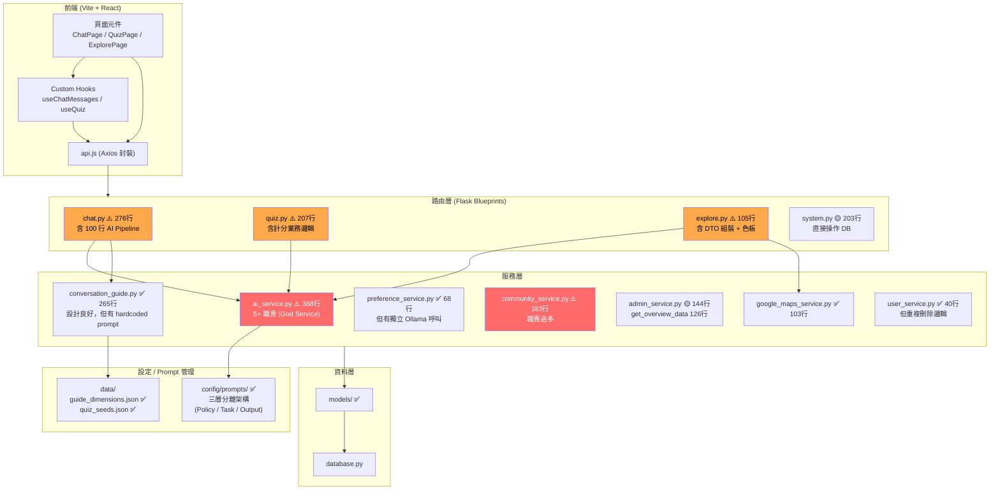
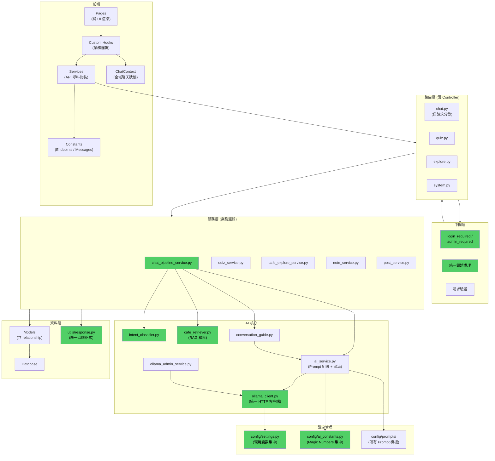

# CafeMatch AI 系統架構審查報告與改進檢查清單

## 審查範圍

本次審查由 4 個並行研究代理分別深入分析：

| 維度 | 涵蓋檔案 |
|------|---------|
| AI 服務核心 | [ai_service.py](file:///c:/Users/user/Desktop/CafeMatch_local/services/ai_service.py)、[conversation_guide.py](file:///c:/Users/user/Desktop/CafeMatch_local/services/conversation_guide.py)、[config/prompts/](file:///c:/Users/user/Desktop/CafeMatch_local/config/prompts) |
| 路由 / Controller | [routes/chat.py](file:///c:/Users/user/Desktop/CafeMatch_local/routes/chat.py)、[routes/quiz.py](file:///c:/Users/user/Desktop/CafeMatch_local/routes/quiz.py)、[routes/explore.py](file:///c:/Users/user/Desktop/CafeMatch_local/routes/explore.py)、[routes/system.py](file:///c:/Users/user/Desktop/CafeMatch_local/routes/system.py) |
| 前端整合 | [frontend/src/pages/](file:///c:/Users/user/Desktop/CafeMatch_local/frontend/src/pages)、[frontend/src/hooks/](file:///c:/Users/user/Desktop/CafeMatch_local/frontend/src/hooks)、[frontend/src/context/](file:///c:/Users/user/Desktop/CafeMatch_local/frontend/src/context) |
| 共用基礎設施 | [services/community_service.py](file:///c:/Users/user/Desktop/CafeMatch_local/services/community_service.py)、[services/preference_service.py](file:///c:/Users/user/Desktop/CafeMatch_local/services/preference_service.py)、[utils.py](file:///c:/Users/user/Desktop/CafeMatch_local/utils.py)、Models 層 |

---

## 目前架構總覽



> [!CAUTION]
> 🔴 紅色 = 嚴重架構問題，應優先處理
> 🟡 橘色 = 職責邊界模糊，建議重構

---

## 一、嚴重問題（High Priority）

### 1.1 `ai_service.py` — God Service 反模式

| 項目 | 現況 |
|------|------|
| 規模 | 388 行 / 14,004 bytes |
| 職責數 | 5+ 種 |

**承載的 5 個不同職責**：
1. **意圖分類**（`classify_intent`）— 基於關鍵字的規則式分類
2. **RAG 檢索**（`retrieve_cafe_context`）— SQLAlchemy 查詢與資料格式化
3. **Prompt 組裝**（`build_prompt`）— 多層 XML 標籤組裝
4. **LLM 串流呼叫**（`stream_generate`）— Ollama API + Token 攔截
5. **Ollama 基礎設施管理**（`check_health`、`list_models`、`delete_model`）— 伺服器管理

> [!WARNING]
> 「Ollama 基礎設施管理」是管理後台功能，「AI 對話生成」是使用者端功能，兩者本質不同卻混在同一個檔案。

**額外問題**：
- `retrieve_cafe_context` 接收 Model class 作為參數（`Cafes`、`Tags`），違反依賴反轉原則
- `stream_generate` 接收 `db` 和 `AiQueryLog` 作為參數 — Service 不應需要外部傳入 ORM 類別
- `DEFAULT_MODEL = "llama3.2:3b"` 定義了卻**從未使用**（Dead Code）

---

### 1.2 缺乏統一的 Ollama 客戶端抽象

**`OLLAMA_BASE_URL` 重複定義**：

```diff
# ai_service.py L23
OLLAMA_BASE_URL = "http://localhost:11434"

# preference_service.py L8
OLLAMA_BASE_URL = "http://localhost:11434"
```

**Ollama HTTP 呼叫模式重複**：
- `ai_service.py:247` — `requests.post(ollama_url, json=payload, stream=True, timeout=300)`
- `preference_service.py:45` — `requests.post(ollama_url, json=payload, timeout=10)`

兩處各自建構 payload、發送 POST、解析 JSON、處理錯誤，無共用抽象。

---

### 1.3 路由層是 Fat Controller — `chat.py` 最嚴重

#### [routes/chat.py](file:///c:/Users/user/Desktop/CafeMatch_local/routes/chat.py) `chat_with_ai()` (L140-L243)

100 行的 generator 函式包含完整的 AI Pipeline：

| 行數範圍 | 做了什麼 | 應該在哪裡 |
|----------|---------|-----------|
| L159 | 意圖分類 `ai_service.classify_intent()` | ✅ 正確委派 |
| L160-L164 | `exit_keywords` 二次判斷 | ❌ 應在 `classify_intent` 或獨立 service |
| L170-L193 | 測驗結果判斷 + quiz_consent 短路回傳 | ❌ 業務邏輯在路由 |
| L179-L183 | 關鍵字合併邏輯 | ❌ 應在 service 層 |
| L185-L187 | conversation_guide 調用 + history 組裝 | ❌ 應在 service 層 |
| L196-L210 | cafe context 檢索 + prompt 組裝 | ❌ 應在 service 層 |
| L213-L221 | 使用者身分查詢與權限判斷 | ❌ 重複 auth 邏輯 |

> [!CAUTION]
> **L191 hardcoded 文案**：「太好了！那請點擊下方卡片，我們馬上開始囉～」直接寫在路由中，**嚴重違反 AGENTS.md 規則**。

#### [routes/quiz.py](file:///c:/Users/user/Desktop/CafeMatch_local/routes/quiz.py)
- `determine_result_type()` (L7-L32)：純業務邏輯（計分維度比較）定義為**模組級函式**
- `quiz_submit()` (L58-L126)：分數計算 → 結果判定 → DB 寫入 → 回應組裝全在路由
- 序列化邏輯重複 3 處（L108-L114、L145-L157、L193-L199）

#### [routes/explore.py](file:///c:/Users/user/Desktop/CafeMatch_local/routes/explore.py)
- 70 行的 `get_cafes()` 包含：使用者狀態查詢、營業時間格式化、**色板硬編碼** (L51-L57)、完整 DTO 組裝

---

### 1.4 認證邏輯重複 39 處

```python
# 此模式在 routes/ 中出現 39 次
user_email = session.get('user_email')
if not user_email:
    return jsonify({"error": "請先登入"}), 401
user = User.query.filter_by(email=user_email).first()
if not user:
    return jsonify({"error": "使用者不存在"}), 404
```

已有 `admin_required` 裝飾器，但**缺少對應的 `login_required` 裝飾器**。

---

### 1.5 `community_service.py` — God Service + 重複邏輯

| 項目 | 現況 |
|------|------|
| 規模 | 383 行 / 15,723 bytes |
| 職責 | 便利貼 CRUD + 貼文 CRUD + 按讚 + 留言 + 轉發 |

**重複邏輯**：

| 重複模式 | 出現位置 |
|---------|---------|
| 級聯刪除（`PostLike`/`PostComment` 清理） | `community_service.py` L376-378 ↔ `user_service.py` L21-23 |
| 便利貼級聯刪除 | `community_service.py` L83-84 ↔ `user_service.py` L14-15 |
| Toggle Like 邏輯 | `toggle_like_note()` ↔ `toggle_like_post()`（幾乎一致） |
| 留言查詢模式 | `get_note_comments()` ↔ `get_post_comments()`（結構一致） |
| 序列化模式 | `user_name`/`user_picture`/`created_at` 格式化出現 10+ 次 |

---

## 二、中等問題（Medium Priority）

### 2.1 Prompt 管理 — 架構正確但執行不完整

**✅ 正面**：`config/prompts/` 已建立三層分離架構：
- **Policy Layer**（`policy_system_prompt.py`）— 全域禁令
- **Task Layer**（`task_rules.py`）— 任務規範
- **Output Format Layer**（`output_format.py`）— 輸出格式

**❌ 問題**：

| 問題 | 位置 |
|------|------|
| `__init__.py` 未做 re-export | `config/prompts/__init__.py` — 只有空白註解 |
| 硬編碼任務指令字串 | `conversation_guide.py` L77、L85、L91、L133-L145 |
| 硬編碼萃取指令 | `preference_service.py` L23、L26 |
| `[SHOW_QUIZ_CARD]` 邏輯衝突 | `chat.py` L191 硬寫回應 ↔ `conversation_guide.py` L77 產生指令 — **兩處重疊且互相衝突** |

---

### 2.2 錯誤處理全面不一致

**API 錯誤回應格式**：

| 檔案 | 格式 |
|------|------|
| `chat.py` | `{"error": "..."}` |
| `quiz.py` | `{"error": "..."}` |
| `system.py` | `{"success": false, "message": "..."}` |
| `explore.py` | `{"error": "..."}` |

**日誌機制混用**：

| 檔案 | 方式 |
|------|------|
| `ai_service.py` | `print(f"RAG 查詢失敗: {e}")` |
| `preference_service.py` | `logging.error(...)` |
| `admin_service.py` | `print(f'Log error: {e}')` |
| 其他服務 | 完全不處理例外 |

**交易管理不一致**：
- `admin_service.py` 的 `log_action()` 有 `try/except + rollback`
- `community_service.py` 所有方法**完全沒有 `try/except`**
- `user_service.py` 的 `delete_user_data()` 也**沒有 `try/except`**

---

### 2.3 Magic Numbers 散落各處

| 位置 | 值 | 意義 |
|------|------|------|
| `ai_service.py:247` | `timeout=300` | 串流生成超時（5 分鐘） |
| `ai_service.py:325` | `timeout=3` | 健康檢查超時 |
| `ai_service.py:95` | `.limit(5)` | 標籤匹配最多取 5 家 |
| `ai_service.py:100` | `.limit(3)` | 名稱匹配最多取 3 家 |
| `ai_service.py:117` | `cafe.tags[:8]` | 最多取 8 個標籤 |
| `ai_service.py:194` | `history[-6:]` | 最近 3 輪對話 |
| `preference_service.py:17` | `history[-10:]` | 最近 10 筆歷史 |
| `preference_service.py:45` | `timeout=10` | 萃取超時 |

---

### 2.4 環境變數與設定管理分散

| 設定項 | 管理方式 | 問題 |
|--------|----------|------|
| `OLLAMA_BASE_URL` | **Hardcode** 在兩個服務檔中 | 無法透過環境變數覆蓋，重複定義 |
| `GOOGLE_MAPS_API_KEY` | `current_app.config.get(...)` | 正確，但 service 直接依賴 Flask context |
| `OLLAMA_MODEL` | `current_app.config[...]` | 在多處重複取得預設 model 的邏輯 |
| `ANALYSIS_KEYWORDS` | Hardcode 在 `admin_service.py` L80-86 | 36 個關鍵字直接寫在程式碼中 |

**核心問題**：沒有集中的 `config.py` 或 `settings.py` 來管理所有環境設定。

---

### 2.5 前端元件過大 + API 呼叫散落

- `ChatPage.jsx`（~350+ 行）：混合 UI 渲染、聊天邏輯、API 呼叫、狀態管理
- `QuizPage.jsx`（~300+ 行）：類似膨脹問題
- API endpoint 字串散落在各頁面元件和 hook 中，未統一管理
- 缺少專門的 `ChatContext` 來管理全域聊天狀態
- 錯誤處理和載入狀態管理在不同元件中做法不一致

---

### 2.6 資料模型設計瑕疵

| 模型 | 問題 |
|------|------|
| `ChatSession` | 缺少 `created_at` 欄位 |
| `AiQueryLog` | 缺少 `query_text`/`response_text` 欄位，無法重現問題場景 |
| `UserQuizResult.filter_tags` | 用 `db.String(200)` 存逗號分隔字串，應用 JSON 欄位或關聯表 |
| `QuizResultType.condition` | 在路由中完全沒有被使用 |
| `UserQuizResult` → `QuizResultType` | 缺少 relationship 定義（用手動查詢替代，造成 N+1） |

---

## 三、低優先級問題（Low Priority）

### 3.1 Dead Code
- `ai_service.py` 的 `DEFAULT_MODEL = "llama3.2:3b"` 從未使用
- `conversation_guide.py` 的 `_extract_collected_dimensions` 定義了卻未被使用

### 3.2 程式碼衛生
- `conversation_guide.py:127` 的 `import random` 寫在函式內部
- `utils.py` 的 `admin_required` 在函式內延遲匯入 `wraps` — code smell
- 全面使用 `datetime.utcnow()`（Python 3.12+ 已標記 deprecated，應改用 `datetime.now(timezone.utc)`）
- 日期格式化不統一：`'%Y-%m-%d %H:%M'` vs `'%Y-%m-%d %H:%M:%S'`

### 3.3 Google Maps 服務缺少快取與速率限制

### 3.4 `services/__init__.py` 未匯出任何模組

---

## 整體架構品質評分

| 維度 | 評分 | 說明 |
|------|------|------|
| 職責分離 | ⭐⭐⭐☆☆ | Prompt 三層分離好，但 ai_service.py 和 community_service.py 職責過多 |
| 模組化 | ⭐⭐⭐☆☆ | 大方向正確，但重複邏輯多、Prompt 散落 |
| 可維護性 | ⭐⭐⭐☆☆ | 文檔齊全，但 magic number 多、日誌不統一 |
| 可擴展性 | ⭐⭐☆☆☆ | 缺少抽象層，新增 AI 功能需複製模式 |
| 錯誤處理 | ⭐⭐☆☆☆ | 格式不統一、交易管理不一致、靜默失敗 |
| 程式碼衛生 | ⭐⭐⭐☆☆ | 有 dead code、函式內 import、print 語句 |

---

## 改進檢查清單

> [!IMPORTANT]
> 建議按「嚴重 → 中等 → 低」的順序處理，避免在不穩定架構上持續堆疊。

### 🔴 嚴重（應優先處理）— 10 項

- [ ] **建立 `services/ollama_client.py`**：統一的 Ollama HTTP 客戶端（URL、timeout、錯誤處理、重試），消除 `ai_service.py` 和 `preference_service.py` 的重複呼叫
- [ ] **拆分 `ai_service.py`**：
  - `services/ai_service.py` → 保留 Prompt 組裝 + 串流呼叫（核心對話）
  - `services/intent_classifier.py` → 拆出 `classify_intent` + `CAFE_KEYWORDS`
  - `services/cafe_retriever.py` → 拆出 `retrieve_cafe_context`（RAG 檢索）
  - `services/ollama_admin_service.py` → 拆出 `check_health` / `list_models` / `delete_model`
- [ ] **路由層瘦身 — `chat.py`**：將 `chat_with_ai()` 的 100 行 AI Pipeline 遷移到 `services/chat_pipeline_service.py`，路由只負責建立 Response
- [ ] **路由層瘦身 — `quiz.py`**：將 `determine_result_type()`、計分邏輯、序列化遷移到 `services/quiz_service.py`
- [ ] **路由層瘦身 — `explore.py`**：將 DTO 組裝、色板、營業時間格式化遷移到 `services/cafe_explore_service.py`
- [ ] **建立 `login_required` 裝飾器**：消除 39 處重複的認證模式（`session.get` + `User.query`）
- [ ] **拆分 `community_service.py`**：拆為 `note_service.py`（便利貼 CRUD）和 `post_service.py`（貼文 CRUD），抽取共用的 `_delete_cascade` 和 `toggle_like` 邏輯
- [ ] **修復 `[SHOW_QUIZ_CARD]` 邏輯衝突**：`chat.py` L189-L193 與 `conversation_guide.py` L77 的邏輯重疊，統一處理入口
- [ ] **移除路由層 hardcoded 文案**：「太好了！那請點擊下方卡片...」等文案移到常數檔
- [ ] **統一 API 錯誤回應格式**：建立 `utils/response.py`，定義 `error_response(message, code)` 和 `success_response(data)` 工廠函式

### 🟡 中等（建議盡早處理）— 10 項

- [ ] **集中 Prompt 管理**：將 `conversation_guide.py` 和 `preference_service.py` 的硬編碼 prompt 移到 `config/prompts/guide_instructions.py`
- [ ] **`config/prompts/__init__.py` re-export**：統一匯出所有 prompt 常數
- [ ] **建立 `config/ai_constants.py`**：集中管理所有 timeout、limit、magic number
- [ ] **建立 `config/settings.py`**：集中管理 `OLLAMA_BASE_URL`、`ANALYSIS_KEYWORDS` 等設定
- [ ] **統一日誌策略**：全面改用 `logging` 模組，移除所有 `print()` 錯誤輸出
- [ ] **統一交易管理**：所有 service 層的 DB 操作加入 `try/except + rollback`
- [ ] **拆分 `admin_service.get_overview_data()`**：拆為 `get_kpi_data()`、`get_chart_data()`、`get_keyword_analysis()`
- [ ] **建立前端 API 服務模組**：`services/chatService.js`、`services/quizService.js`，集中管理 API 呼叫和 endpoint 常數
- [ ] **拆分大型前端元件**：`ChatPage.jsx`、`QuizPage.jsx` 的業務邏輯抽到 custom hooks
- [ ] **建立統一請求驗證**：引入驗證 decorator 或 schema validation

### 🟢 低優先級（視情況處理）— 6 項

- [ ] **清理 Dead Code**：移除 `DEFAULT_MODEL`、`_extract_collected_dimensions`；將 `import random` 移到檔案頂部
- [ ] **修復 Model 設計**：`ChatSession` 加 `created_at`、`UserQuizResult.filter_tags` 改 JSON、補 relationship 定義
- [ ] **重新命名 `utils.py`**：改為 `middleware/auth.py` 或 `decorators/auth.py`
- [ ] **替換 `datetime.utcnow()`**：改用 `datetime.now(timezone.utc)`，統一日期格式常數
- [ ] **Google Maps 快取與速率限制**
- [ ] **建立前端 `ChatContext`**：為跨頁面聊天狀態管理建立專屬 Context

---

## 建議的目標架構



> [!TIP]
> 🟢 綠色 = 目標架構中新增的關鍵模組

---

## 驗證方式

### 自動測試
- 現有功能的整合測試確保行為不變
- 新拆分的 AI 服務模組各自的單元測試
- `login_required` 裝飾器的單元測試
- 統一錯誤回應格式的測試

### 手動驗證
- AI 聊天功能端對端測試（含串流回應）
- 問答生成、計分、歷史紀錄流程測試
- 咖啡廳探索功能測試
- 社群便利貼與貼文完整 CRUD 測試
- 管理員後台功能測試
